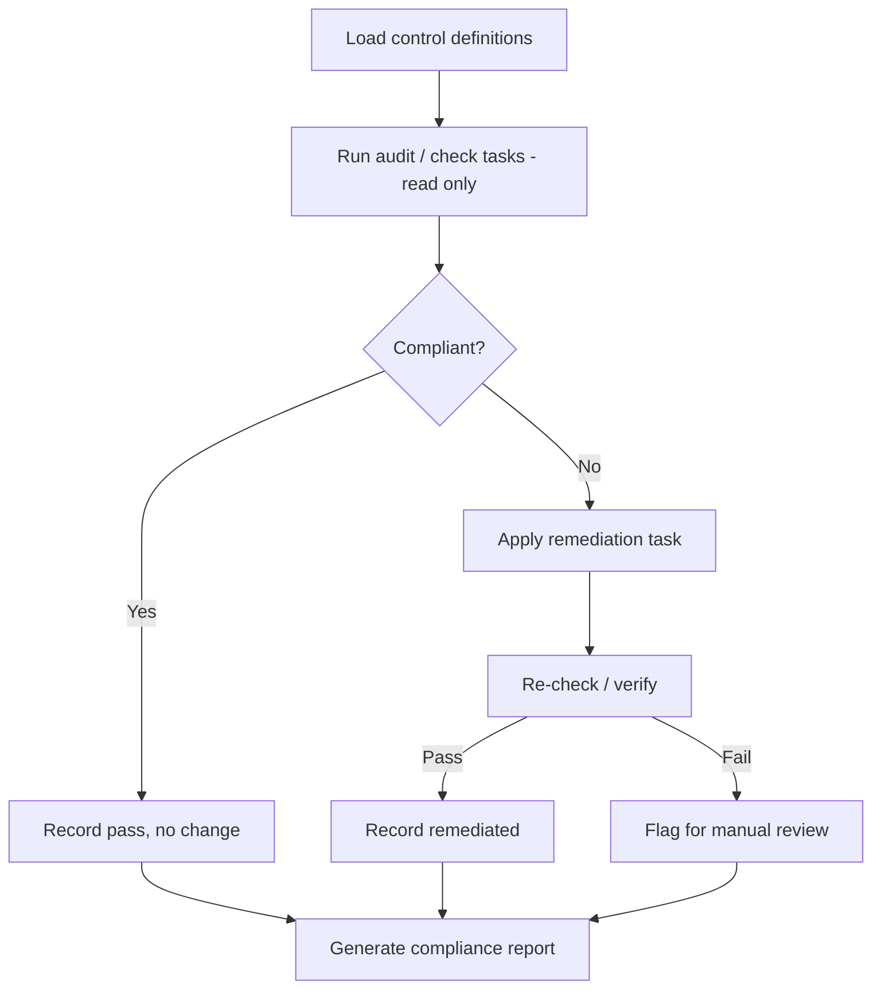

# Workshop: Compliance-as-Code & Security Hardening for Ubuntu (via Ansible)

**CIS-Style Checks, Remediation, and Repeatable Hardening Playbooks**

---

## 1. Workshop Objectives

By the end of this session, participants will be able to:

1. Explain what "compliance-as-code" means in practice and how it differs from manual audits/checklists.
2. Structure a simple CIS-style **check → remediate → verify** flow for Ubuntu.
3. Map common CIS Ubuntu Benchmark controls to concrete, built-in Ansible modules.
4. Draft a first-pass hardening playbook (or role) during the session, with checks kept separate from remediation.

**Audience:** Systems/Platform engineers, SRE, security engineers, automation engineers responsible for baseline hardening and audit evidence.

**Duration:** 2.5–3 hours (splittable into two 90-minute sessions).

**Prerequisites:**
- Familiarity with Ansible basics (inventory, playbooks, roles, handlers)
- Read access to any existing hardening scripts/benchmarks currently in use
- A non-production Ubuntu test group for the hands-on portion
- (Optional) A copy or excerpt of the CIS Ubuntu Linux Benchmark for reference

---

## 2. Agenda

| Time | Segment |
|---|---|
| 0:00–0:15 | Kickoff — what "compliance-as-code" means here, current-state review |
| 0:15–0:40 | Compliance-as-code flow (design discussion) |
| 0:40–1:25 | Built-in module walkthrough: check, remediate, verify/report |
| 1:25–1:40 | Break |
| 1:40–2:10 | Hands-on: build a check-and-remediate task pair for 2–3 controls |
| 2:10–2:40 | Scalability & repeatability discussion (idempotency, exceptions, drift) |
| 2:40–3:00 | Gaps, action items, ownership |

---

## 3. Discussion: What Is Compliance-as-Code, Here?

Frame this early so the room has a shared definition before diving into modules:

- **Compliance-as-code** = security/compliance requirements expressed as version-controlled, executable checks and remediations, run the same way every time — not a person following a PDF checklist.
- A **CIS Benchmark control** typically has three parts worth preserving in the playbook design:
  1. **Audit** — how to check current state (read-only, non-destructive)
  2. **Remediation** — how to fix it if non-compliant
  3. **Rationale/Impact** — why it matters, and what might break (important for exceptions)

### 3.1 The check → remediate → verify flow



### 3.2 Discussion prompts against the current state

1. **Separation of concerns**
   - Are checks and remediations currently mixed into one step, or can "audit-only" mode be run safely without changing anything?
   - Ansible's `--check` (dry-run) mode is a natural fit here — does the current automation support it cleanly?

2. **Scope of "hardening" today**
   - Which CIS sections are already covered (filesystem, SSH, auditd, firewall, password policy, services), and which are gaps?

3. **Evidence/reporting**
   - Is there a machine-readable pass/fail record per control, per host? Or just "the playbook ran successfully"?

4. **Exceptions**
   - How are legitimate deviations from a benchmark handled today (e.g., a control that would break an app)? Is that documented anywhere, or tribal knowledge?

5. **Drift**
   - Once hardened, is compliance re-verified periodically, or only enforced at build time?

> **Output of this section:** an annotated list of CIS control areas, marked ✅ covered / ⚠️ partial / ❌ not covered in current automation.

---

## 4. Built-in Modules by Stage

All modules below are Ansible built-ins (`ansible.builtin` unless noted) — enough to get a working v1 without third-party collections. Where a dedicated compliance collection would help at scale, it's noted separately in §4.5.

### 4.1 Audit / Check (read-only)

| Purpose | Module | Notes |
|---|---|---|
| Read a config file's current value | `ansible.builtin.slurp` or `ansible.builtin.lineinfile` (check mode) | `slurp` for arbitrary parsing; `lineinfile` with `check_mode: true` reports would-be changes without applying |
| Check file permissions/ownership | `ansible.builtin.stat` | Inspect mode, owner, group on sensitive files (`/etc/shadow`, `/etc/passwd`, cron dirs) |
| Check installed/forbidden packages | `ansible.builtin.package_facts` | Compare against an allow/deny list (e.g., flag `telnet`, `xinetd` if present) |
| Check running/enabled services | `ansible.builtin.service_facts` | Flag unwanted services (e.g., `avahi-daemon`, `cups` on servers) |
| Check kernel/sysctl parameters | `ansible.builtin.command` (`sysctl -n <param>`) with `changed_when: false`, or `ansible.builtin.setup` with `ansible_facts` where available | No pure declarative "read sysctl" built-in; wrap read-only shell calls explicitly |
| Check user/group account settings | `ansible.builtin.getent` | Read-only lookup of passwd/group/shadow databases via NSS |
| Validate a value against expected compliance state | `ansible.builtin.assert` | Central pattern: `register` the check, then `assert` with `fail_msg` describing the control ID |

### 4.2 Remediation

| Purpose | Module | Notes |
|---|---|---|
| Enforce a config line/value (e.g., `sshd_config`) | `ansible.builtin.lineinfile` | Idempotent — the core workhorse for most CIS text-file controls |
| Enforce a config block | `ansible.builtin.blockinfile` | Good for multi-line, clearly-delimited sections |
| Full template-managed config file | `ansible.builtin.template` | Preferred when a file should be fully owned/managed rather than patched line-by-line |
| Set file permissions/ownership | `ansible.builtin.file` | e.g., `mode: '0600'` on `/etc/shadow`, correct ownership on cron directories |
| Remove or hold disallowed packages | `ansible.builtin.apt` (`state: absent`) / `ansible.builtin.dpkg_selections` (`selection: hold`) | Use `hold` where a package must not be reinstalled/upgraded unexpectedly |
| Disable/mask unwanted services | `ansible.builtin.systemd_service` (or `ansible.builtin.service`) | `enabled: false`, `masked: true` where CIS calls for full disablement |
| Enforce sysctl/kernel parameters | `ansible.builtin.sysctl` | Built-in, persists to `/etc/sysctl.d/`, applies immediately with `reload: true` |
| Enforce password policy (`/etc/login.defs`, PAM) | `ansible.builtin.lineinfile` on `login.defs`; `ansible.builtin.pamd` | `pamd` is a built-in for structured PAM rule editing (better than raw `lineinfile` on PAM files) |
| Manage user/group compliance (e.g., lock unused accounts) | `ansible.builtin.user` | `password_lock`, `shell: /usr/sbin/nologin`, expiry settings |
| Configure firewall baseline (UFW) | `community.general.ufw` | Not core `ansible.builtin`, but the standard, well-maintained module for Ubuntu's default firewall — flag this as the one common non-builtin dependency |
| Ensure auditd rules present | `ansible.builtin.lineinfile` on `/etc/audit/rules.d/*.rules` + handler to reload auditd | No dedicated built-in for audit rules; file-based management is standard |
| Restart/reload service after remediation | `ansible.builtin.service` (as a **handler**, notified by the remediation task) | Keeps remediation idempotent — only restarts when a change actually occurred |

### 4.3 Verify (re-check after remediation)

| Purpose | Module | Notes |
|---|---|---|
| Re-run the same audit task post-remediation | Re-use the §4.1 check task | Structure checks as reusable tasks/handlers so "verify" is literally "run the check again" |
| Confirm no unintended breakage | `ansible.builtin.wait_for` / `ansible.builtin.uri` | If hardening touches SSH or a listening service, confirm it still accepts connections before ending the play |
| Fail the run explicitly on unresolved non-compliance | `ansible.builtin.fail` | Distinguish "control could not be remediated" from "control not applicable" |
| Skip a control intentionally (documented exception) | `when:` condition against a `compliance_exceptions` variable | Keeps exceptions explicit and auditable in group_vars rather than commented-out tasks |

### 4.4 Reporting / Evidence

| Purpose | Module | Notes |
|---|---|---|
| Emit structured per-control result | `ansible.builtin.set_fact` (build a result dict) + `ansible.builtin.template` | Render a JSON/YAML compliance report per host |
| Aggregate results to the control node | `ansible.builtin.fetch` | Pull per-host reports for central review/dashboarding |
| Callback-level run summary | Ansible's built-in `json` or `yaml` callback plugin (config, not a module) | Useful for CI-triggered compliance runs — machine-parsable output without custom code |
| Notify on failed controls | `ansible.builtin.uri` (webhook) | Same pattern as patch-run alerting — built-in, no extra collection needed |

### 4.5 Where a dedicated collection helps at scale

Worth flagging to the group as a "graduate to this later" note, not a v1 requirement:

- **`community.general`** — brings `ufw`, plus various hardening-adjacent modules beyond core builtins.
- **OpenSCAP / `ansible-lockdown` roles** (e.g., `ansible-lockdown.UBUNTU22-CIS`) — pre-built, maintained CIS-mapped roles if hand-rolling every control doesn't scale for your team. Good to mention as a build-vs-adopt decision point, not to replace the exercise below.

---

## 5. Minimal Playbook Skeleton (discussion artifact, not final)

Structured so **each control is a self-contained check → remediate → verify unit**, tagged by CIS control ID for selective runs and reporting.

```yaml
---
- name: Ubuntu CIS-Style Hardening Playbook (sample controls)
  hosts: hardening_targets
  become: true
  vars:
    compliance_exceptions: []   # e.g., ["CIS-5.2.10"] to skip a control intentionally
    compliance_results: []

  tasks:

    ## --- Control: CIS-5.2.10 - Ensure SSH root login is disabled ---
    - name: "CIS-5.2.10 - Check PermitRootLogin"
      ansible.builtin.command: sshd -T
      register: sshd_config_check
      changed_when: false
      when: "'CIS-5.2.10' not in compliance_exceptions"

    - name: "CIS-5.2.10 - Remediate PermitRootLogin"
      ansible.builtin.lineinfile:
        path: /etc/ssh/sshd_config
        regexp: '^#?PermitRootLogin'
        line: 'PermitRootLogin no'
      notify: restart sshd
      when:
        - "'CIS-5.2.10' not in compliance_exceptions"
        - "'permitrootlogin yes' in sshd_config_check.stdout | lower"

    ## --- Control: CIS-1.1.x - Ensure /tmp permissions are restrictive ---
    - name: "CIS-1.1.x - Check /tmp permissions"
      ansible.builtin.stat:
        path: /tmp
      register: tmp_perms
      when: "'CIS-1.1.x' not in compliance_exceptions"

    - name: "CIS-1.1.x - Remediate /tmp permissions"
      ansible.builtin.file:
        path: /tmp
        mode: '1777'
        state: directory
      when:
        - "'CIS-1.1.x' not in compliance_exceptions"
        - tmp_perms.stat.mode != '1777'

    ## --- Control: CIS-3.x - Enforce a sysctl hardening parameter ---
    - name: "CIS-3.x - Enforce IP forwarding disabled"
      ansible.builtin.sysctl:
        name: net.ipv4.ip_forward
        value: '0'
        state: present
        reload: true
      when: "'CIS-3.x' not in compliance_exceptions"

    ## --- Control: remove disallowed package ---
    - name: "CIS-2.x - Ensure telnet is not installed"
      ansible.builtin.apt:
        name: telnet
        state: absent
      when: "'CIS-2.x' not in compliance_exceptions"

    ## --- Verify: re-check a sample control post-remediation ---
    - name: "CIS-5.2.10 - Verify PermitRootLogin after remediation"
      ansible.builtin.command: sshd -T
      register: sshd_verify
      changed_when: false
      failed_when: "'permitrootlogin yes' in sshd_verify.stdout | lower"
      when: "'CIS-5.2.10' not in compliance_exceptions"

  handlers:
    - name: restart sshd
      ansible.builtin.service:
        name: ssh
        state: restarted
```

---

## 6. Scalability & Repeatability Discussion

1. **One control = one reusable unit**
   - Should each CIS control live as its own task file/role (`roles/cis_5_2_10/tasks/main.yml`) so it can be included, tagged, and reported on independently?
   - Tag every task with the control ID (`tags: ["CIS-5.2.10"]`) to allow `--tags`/`--skip-tags` runs for partial audits.

2. **Audit-only vs. enforce mode**
   - Design controls so `--check` mode (or an explicit `enforce: false` variable) gives a true dry-run compliance report without touching hosts.

3. **Exceptions as data, not code edits**
   - Keep `compliance_exceptions` in group_vars/host_vars rather than commenting out tasks — makes exceptions visible, reviewable, and auditable.

4. **Idempotency**
   - Every remediation task must be safe to re-run on an already-compliant host with `changed: false` — this is what makes periodic re-runs meaningful evidence, not just one-time hardening.

5. **Drift detection cadence**
   - Should this playbook run in enforce mode on every deploy, and in audit-only mode on a schedule (e.g., nightly) to catch drift between hardening events?

6. **Reporting as evidence**
   - Structured, per-control, per-host pass/fail output (JSON) feeding a central store — this becomes the actual audit evidence, not "the pipeline turned green."

7. **Build vs. adopt**
   - At what point does hand-rolling controls stop scaling, and does adopting a maintained CIS role collection (e.g., `ansible-lockdown`) make sense, with this playbook's custom controls layered on top for org-specific requirements?

---

## 7. Exercise (Hands-on, 30 min)

Working in pairs against the test Ubuntu group:

1. Pick 2–3 CIS controls relevant to your environment (SSH config, a sysctl parameter, a disallowed package/service).
2. Write the **check** task first — run it in isolation and confirm it correctly reports non-compliant state on the test hosts.
3. Add the **remediation** task, tagged with the control ID, and re-run.
4. Add a **verify** task that fails loudly if remediation didn't take effect.
5. Discuss as a pair: which of your 2–3 controls would be safe to auto-remediate in production, and which should only ever alert for manual review?

---

## 8. Gaps & Action Items Template

| Control area | Current state | Target state | Owner | Target date |
|---|---|---|---|---|
| SSH hardening | | | | |
| Filesystem permissions | | | | |
| Package/service baseline | | | | |
| Firewall (UFW) | | | | |
| Audit logging (auditd) | | | | |
| Password/account policy | | | | |

---

## 9. Reference Summary

- **Flow:** load controls → audit (read-only) → remediate if non-compliant → verify → report
- **Check:** `stat`, `slurp`, `command` (read-only), `package_facts`, `service_facts`, `getent`, `assert`
- **Remediate:** `lineinfile`, `blockinfile`, `template`, `file`, `apt`, `dpkg_selections`, `systemd_service`, `sysctl`, `pamd`, `user`, `community.general.ufw`
- **Verify/report:** re-run checks, `wait_for`/`uri` for service impact, `fail` on unresolved gaps, `set_fact` + `template` for structured evidence
- **Scale levers:** per-control task files, tagging by control ID, audit-only vs. enforce modes, exceptions as variables, idempotency, scheduled drift checks
