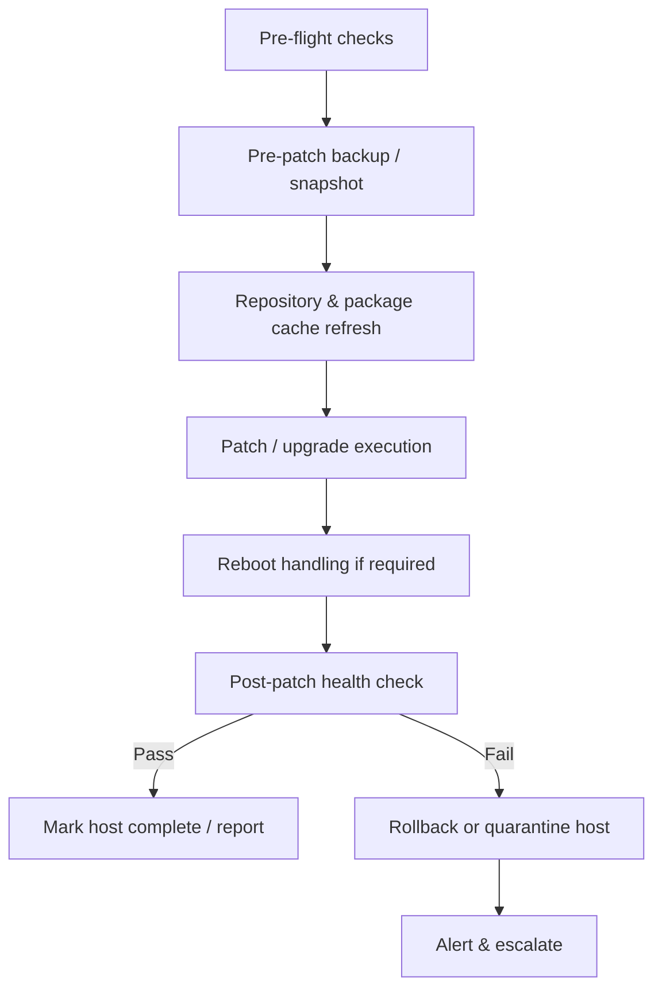

# Workshop: Patch Management Playbook Design for Ubuntu

**Aligning with Existing Patching Automation — Toward a Scalable, Repeatable Framework**

---

## 1. Workshop Objectives

By the end of this session, participants will be able to:

1. Describe the end-to-end flow a patch management playbook should follow.
2. Map each stage of that flow to concrete, built-in Ansible modules (backup → upgrade → post-health check).
3. Identify where the current patching automation deviates from this flow and where it can be made more scalable and repeatable.
4. Draft a first-pass playbook skeleton for Ubuntu fleets during the session.

**Audience:** Systems/Platform engineers, SRE, automation engineers responsible for Ubuntu patch cycles.

**Duration:** 2.5–3 hours (can be split into two 90-minute sessions).

**Prerequisites:**
- Familiarity with Ansible basics (inventory, playbooks, roles)
- Read access to the current patching automation repo/pipeline
- A non-production Ubuntu test group (VMs or containers) for the hands-on portion

---

## 2. Agenda

| Time | Segment |
|---|---|
| 0:00–0:15 | Kickoff — current-state review of existing patching automation |
| 0:15–0:45 | Target patch management flow (design discussion) |
| 0:45–1:30 | Built-in module walkthrough: backup, upgrade, post-health check |
| 1:30–1:45 | Break |
| 1:45–2:15 | Hands-on: build a minimal playbook against test hosts |
| 2:15–2:45 | Scalability & repeatability discussion (variables, tags, batching, rollback) |
| 2:45–3:00 | Gaps, action items, ownership |

---

## 3. Discussion: The Patch Management Flow

Before touching modules, align the group on the **stages** every patch run should pass through. Use this as the whiteboard skeleton.



### 3.1 Stage-by-stage discussion prompts

Use these as talking points to compare against the **existing** automation:

1. **Pre-flight checks**
   - Does the current playbook verify disk space, pending reboots, or maintenance-window membership before starting?
   - Is host eligibility (e.g., tags, patch groups, environment) enforced via inventory/dynamic groups?

2. **Pre-patch backup**
   - What is actually backed up today — package state? Config files? Full snapshot (if VM-level)?
   - Is the backup step conditional/skippable, and is that intentional?

3. **Upgrade execution**
   - Full `dist-upgrade` vs. security-only patching — which does current automation do, and should it be configurable per group?
   - Is upgrade scoped by package list, CVE severity, or blanket upgrade?

4. **Reboot handling**
   - How is "reboot required" detected today? Is it deferred to a maintenance window?

5. **Post-patch health check**
   - What defines "healthy" post-patch — service status, port checks, application-level smoke tests, or just "apt exited 0"?

6. **Rollback / failure handling**
   - Does a failed health check trigger anything today, or is it a manual follow-up?

> **Output of this section:** a shared diagram (adapt the Mermaid flow above) annotated with what the current automation already covers (✅), partially covers (⚠️), and doesn't cover (❌).

---

## 4. Built-in Modules by Stage

This is the core reference mapping for the playbook. All modules below are Ansible built-ins (`ansible.builtin` or `ansible.posix`) — no custom roles required to get a working v1.

### 4.1 Pre-flight

| Purpose | Module | Notes |
|---|---|---|
| Gather facts / OS version, disk, memory | `ansible.builtin.setup` | Runs automatically unless `gather_facts: false` |
| Check disk space before patching | `ansible.builtin.shell` / `ansible.builtin.command` with `df` — or assert against `ansible_facts['mounts']` | Prefer facts over shell where possible |
| Assert minimum free space | `ansible.builtin.assert` | Fail fast before backup/upgrade starts |
| Check for existing pending reboot | `ansible.builtin.stat` on `/var/run/reboot-required` | Ubuntu/Debian-specific marker file |

### 4.2 Backup

| Purpose | Module | Notes |
|---|---|---|
| Snapshot current package state (dpkg selections) | `ansible.builtin.shell` (`dpkg --get-selections`) redirected to a file, or `ansible.builtin.command` | No pure built-in for dpkg selection dump; capture output with `register` and write via `copy`/`template` |
| Backup config files/directories | `ansible.builtin.archive` | Creates a tar/zip archive of specified paths on the remote host |
| Copy backup off-host | `ansible.builtin.fetch` | Pulls the archive back to the control node / backup store |
| APT cache backup (optional, for offline rollback) | `ansible.builtin.copy` of `/var/cache/apt/archives` | Useful if rollback needs original `.deb` files |
| Record pre-patch package versions for diffing | `ansible.builtin.package_facts` | Structured fact list (`ansible_facts.packages`) — better than raw shell for later comparison |

### 4.3 Upgrade

| Purpose | Module | Notes |
|---|---|---|
| Update apt cache | `ansible.builtin.apt` with `update_cache: true` | Set `cache_valid_time` to avoid redundant refreshes across a large fleet |
| Security-only or full upgrade | `ansible.builtin.apt` with `upgrade: safe` (security/recommended) or `upgrade: dist` (full) | `safe` = `apt-get upgrade`; `dist` = `apt-get dist-upgrade` |
| Install/upgrade a specific package list | `ansible.builtin.apt` with `name: [...]`, `state: latest` | Useful for CVE-targeted patch runs |
| Autoremove obsolete packages | `ansible.builtin.apt` with `autoremove: true` | Run after upgrade, not before |
| Hold specific packages from upgrading | `ansible.builtin.dpkg_selections` with `selection: hold` | Built-in module — good for excluding pinned packages |
| Detect if reboot is now required | `ansible.builtin.stat` on `/var/run/reboot-required` | Re-check after upgrade completes |
| Reboot host safely (with wait) | `ansible.builtin.reboot` | Built-in; handles connection loss/reconnect and has configurable timeout |

### 4.4 Post-patch health check

| Purpose | Module | Notes |
|---|---|---|
| Confirm services are running | `ansible.builtin.service_facts` | Compare against a pre-patch baseline list |
| Restart a service if needed | `ansible.builtin.service` | e.g., after library upgrades that don't auto-restart daemons |
| Check a port/endpoint responds | `ansible.builtin.wait_for` | TCP port check with timeout, good gate before marking host healthy |
| HTTP/API-level health check | `ansible.builtin.uri` | Validate app-level `/health` endpoints post-patch |
| Verify no broken/held packages remain | `ansible.builtin.apt` with `state: fixed` (dry considerations) or `ansible.builtin.command` (`apt-get check`) | No fully declarative built-in for `apt-get check`; wrap with `changed_when: false` |
| Compare package versions to pre-patch snapshot | `ansible.builtin.package_facts` (again) + `ansible.builtin.assert` | Diff logic typically done with Jinja against the earlier fact capture |
| Fail the run / flag host on health failure | `ansible.builtin.fail` | Explicit stop with a clear message, feeding into reporting |
| Roll back on failure (package-level) | `ansible.builtin.apt` with pinned `version` from backup snapshot | Requires cached `.deb`s or a reachable prior-version repo |

### 4.5 Reporting / audit trail

| Purpose | Module | Notes |
|---|---|---|
| Write per-host patch report | `ansible.builtin.template` or `ansible.builtin.copy` | Render a Jinja2 report using captured facts |
| Aggregate results centrally | `ansible.builtin.fetch` or `ansible.posix.synchronize` | Pull per-host logs back to a central location |
| Send notification on completion/failure | `ansible.builtin.uri` (webhook) or `community.general.slack` | `uri` is built-in and sufficient for most webhook-based alerting |

---

## 5. Minimal Playbook Skeleton (discussion artifact, not final)

```yaml
---
- name: Ubuntu Patch Management Playbook
  hosts: patch_targets
  become: true
  serial: "{{ patch_batch_size | default('20%') }}"
  vars:
    upgrade_mode: safe          # safe | dist
    min_free_space_mb: 2048
    reboot_allowed: true
    health_check_port: 443

  tasks:
    - name: Pre-flight - assert sufficient disk space
      ansible.builtin.assert:
        that: ansible_facts['mounts'] | selectattr('mount', 'equalto', '/') | map(attribute='size_available') | first > (min_free_space_mb * 1024 * 1024)
        fail_msg: "Insufficient disk space to proceed with patching"

    - name: Backup - capture pre-patch package facts
      ansible.builtin.package_facts:

    - name: Backup - archive key config directories
      ansible.builtin.archive:
        path: /etc
        dest: "/var/backups/pre_patch_etc_{{ ansible_date_time.iso8601_basic_short }}.tar.gz"

    - name: Upgrade - refresh apt cache
      ansible.builtin.apt:
        update_cache: true
        cache_valid_time: 3600

    - name: Upgrade - apply patches
      ansible.builtin.apt:
        upgrade: "{{ upgrade_mode }}"

    - name: Upgrade - remove obsolete packages
      ansible.builtin.apt:
        autoremove: true

    - name: Upgrade - check reboot requirement
      ansible.builtin.stat:
        path: /var/run/reboot-required
      register: reboot_required_file

    - name: Upgrade - reboot if required and allowed
      ansible.builtin.reboot:
        reboot_timeout: 600
      when: reboot_required_file.stat.exists and reboot_allowed

    - name: Post-health - gather service facts
      ansible.builtin.service_facts:

    - name: Post-health - verify critical port responds
      ansible.builtin.wait_for:
        port: "{{ health_check_port }}"
        timeout: 60

    - name: Post-health - fail run on unhealthy host
      ansible.builtin.fail:
        msg: "Host failed post-patch health check"
      when: false   # replace with real health condition
```

---

## 6. Scalability & Repeatability Discussion

Guide the group through these design levers — capture decisions in the workshop notes.

1. **Batching (`serial`)**
   - Should patch runs go in waves (canary → broader fleet) rather than all-at-once?
   - What batch size/percentage is safe for production groups vs. non-prod?

2. **Inventory-driven targeting**
   - Patch groups defined by tags (`patch_group=web`, `patch_ring=1`) rather than hardcoded host lists.
   - Dynamic inventory sourced from CMDB/cloud provider to avoid stale host lists.

3. **Idempotency**
   - Every task should be safe to re-run without side effects — critical for repeatability across scheduled cycles.
   - Avoid raw `shell`/`command` where a built-in module with proper `changed_when` exists.

4. **Configurable upgrade scope**
   - Externalize `upgrade_mode`, package allow/deny lists, and hold lists into group_vars so the same playbook serves multiple patch tiers.

5. **Rollback strategy**
   - Decide whether rollback is package-version pinning, snapshot restore (infra-level), or manual intervention with alerting only.
   - Document the decision — "no automated rollback" is a valid choice if explicitly agreed.

6. **Reporting as a first-class step**
   - Structured, machine-parsable output (JSON/CSV) per host feeding into a dashboard, not just console logs.

7. **Integration with existing automation**
   - Where does this playbook slot into the current pipeline (cron, AWX/Tower, CI job, orchestrator)?
   - What existing steps can be replaced vs. wrapped vs. left as-is?

---

## 7. Exercise (Hands-on, 30 min)

Working in pairs against the test Ubuntu group:

1. Run the pre-flight + backup tasks only (`--tags preflight,backup`) and confirm the archive lands correctly.
2. Run the upgrade stage with `upgrade_mode: safe` and observe reboot detection.
3. Add one real health check relevant to your environment (service or port) to the post-health section.
4. Discuss as a pair: what would make this fail loudly vs. silently in production?

---

## 8. Gaps & Action Items Template

| Gap identified | Current state | Target state | Owner | Target date |
|---|---|---|---|---|
| | | | | |
| | | | | |
| | | | | |

---

## 9. Reference Summary

- **Flow:** pre-flight → backup → upgrade → reboot (conditional) → post-health check → report / rollback
- **Backup:** `package_facts`, `archive`, `fetch`
- **Upgrade:** `apt`, `dpkg_selections`, `reboot`
- **Post-health:** `service_facts`, `service`, `wait_for`, `uri`, `assert`, `fail`
- **Scale levers:** `serial`, tag-based inventory, group_vars-driven config, idempotent tasks, structured reporting
