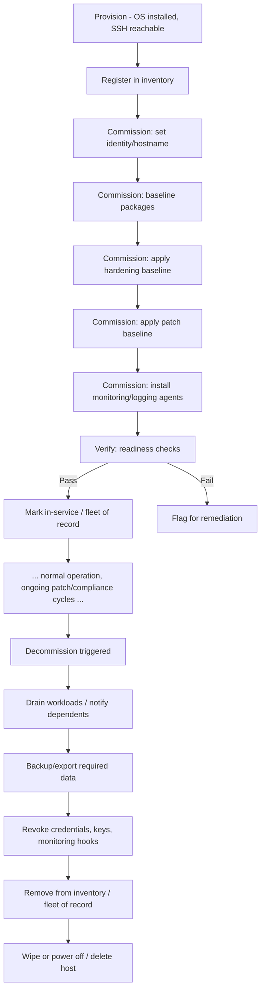

# Workshop: Server Provisioning & Commissioning/Decommissioning for Ubuntu (via Ansible)

**Standardizing Build-Out, Commissioning, and Decommissioning — Starting from a Single-Server Reality**

---

## 0. A Note on Scope

This workshop assumes **one Ubuntu server today**. That changes how the hands-on portion works, but not how the playbooks should be designed — the whole point of standardizing now is that the next server (and the tenth) commission the same way, without re-inventing the process. Every section below flags what matters *today* (single host) vs. what matters *for when this scales*.

---

## 1. Workshop Objectives

By the end of this session, participants will be able to:

1. Describe the full server lifecycle flow: provisioning → commissioning → in-service → decommissioning.
2. Map each lifecycle stage to concrete, built-in Ansible modules.
3. Distinguish **provisioning** (getting the OS/instance to exist) from **commissioning** (making it a compliant, service-ready node) — and see how this builds on the patching and hardening work already covered.
4. Draft a standardized commissioning playbook and a standardized decommissioning playbook, usable against one server now and any number later.

**Audience:** Systems/Platform engineers, SRE, automation engineers responsible for server lifecycle management.

**Duration:** 2–2.5 hours (single session; can trim the scaling discussion if time-constrained).

**Prerequisites:**
- Ansible basics (inventory, playbooks, roles) — same baseline as the patch management and hardening workshops
- SSH/API access to the one existing Ubuntu server (or a disposable VM/container standing in for it during the hands-on)
- Awareness of the patching automation and hardening playbook already built in prior sessions — this workshop assumes those exist and slots into the same flow

---

## 2. Agenda

| Time | Segment |
|---|---|
| 0:00–0:15 | Kickoff — what "commissioning" and "decommissioning" mean here, current-state review |
| 0:15–0:40 | Full lifecycle flow (design discussion) |
| 0:40–1:20 | Built-in module walkthrough: provision, commission, verify, decommission |
| 1:20–1:30 | Break |
| 1:30–2:00 | Hands-on: build a commissioning playbook and a decommissioning playbook against the one server (safely) |
| 2:00–2:20 | Standardization discussion (single host today → many hosts later) |
| 2:20–2:30 | Gaps, action items, ownership |

---

## 3. Discussion: Provisioning vs. Commissioning vs. Decommissioning

Align definitions before designing anything — these three words get used loosely and that causes playbooks to sprawl.

- **Provisioning** — the server *comes into existence*: OS installed, base network/SSH reachable, added to inventory. (Could be manual today, or cloud/VM API-driven later — either way, this workshop treats "provisioned and reachable via SSH" as the starting line.)
- **Commissioning** — the server becomes a *known, compliant, service-ready node*: hostname/identity set, baseline packages installed, hardening applied (builds directly on the earlier CIS/hardening workshop), patching baseline applied (builds on the patch management workshop), monitoring/logging agents installed, added to the "fleet of record."
- **Decommissioning** — the server is *cleanly removed from service*: workloads drained, data backed up/archived per policy, credentials and secrets revoked, monitoring/inventory entries removed, host either wiped or powered off/deleted.

### 3.1 The full lifecycle flow



### 3.2 Discussion prompts against the current state

1. **What exists today for the one server?**
   - Was it commissioned via any repeatable process, or set up by hand? Be honest here — this is the baseline to standardize from, not a judgment.

2. **Overlap with prior work**
   - Which parts of commissioning are *already covered* by the patch management playbook and the hardening playbook built in earlier sessions? (Answer should be: most of the hardening and patching steps — commissioning should **call** those playbooks/roles, not duplicate their logic.)

3. **Identity and inventory**
   - Is there a single source of truth for "this is our server" (static inventory file, CMDB, cloud tags)? With one host this can be simple, but the *pattern* should be the same one you'd use with fifty.

4. **Decommissioning — does it exist at all?**
   - Many teams have provisioning/commissioning automation and *nothing* for decommissioning. Ask directly: if this server needed to be retired tomorrow, what's the process? If the answer is "manual, and probably incomplete," that's the gap this workshop closes.

5. **Data and credential handling on decommission**
   - What data must be preserved (backups, compliance retention) vs. what must be destroyed (keys, secrets, local credentials) before the host disappears?

> **Output of this section:** a lifecycle diagram (adapt the Mermaid flow above) annotated with what's ✅ covered / ⚠️ partial / ❌ missing for the current server.

---

## 4. Built-in Modules by Stage

All built-ins (`ansible.builtin` unless noted). This workshop deliberately **reuses** the modules from the patching and hardening sessions rather than introducing a parallel set — commissioning should orchestrate those existing playbooks, not reinvent them.

### 4.1 Provisioning (getting to "reachable")

| Purpose | Module | Notes |
|---|---|---|
| Confirm host is reachable/SSH-ready | `ansible.builtin.ping` | The standard first task in any provisioning/commissioning play |
| Gather baseline facts | `ansible.builtin.setup` | OS version, architecture, memory — confirms the box matches expectations before proceeding |
| Wait for SSH to come up (if freshly booted) | `ansible.builtin.wait_for_connection` | Useful once provisioning is automated (cloud/VM boot); less relevant for a manually-provisioned single server, but design it in now |
| Set hostname | `ansible.builtin.hostname` | Built-in, idempotent |
| Set timezone | `ansible.builtin.timezone` | Often overlooked, causes log/audit headaches later if inconsistent |
| Configure `/etc/hosts` entries | `ansible.builtin.lineinfile` or `ansible.builtin.template` | Especially relevant once there's more than one host to resolve |

### 4.2 Commissioning (making it service-ready)

| Purpose | Module | Notes |
|---|---|---|
| Install baseline package set | `ansible.builtin.apt` (`name: [...]`, `state: present`) | Define a `baseline_packages` variable list — same pattern as the patch playbook's upgrade scoping |
| Create standard users/groups | `ansible.builtin.user` / `ansible.builtin.group` | Service accounts, admin accounts, per org policy |
| Deploy SSH keys for authorized access | `ansible.builtin.authorized_key` | Built-in, idempotent, avoids hand-editing `authorized_keys` |
| Apply hardening baseline | **Include/import the hardening playbook or role from the compliance workshop** (`ansible.builtin.import_playbook` / `ansible.builtin.include_role`) | This is the key integration point — commissioning should *call* that existing work, not copy its tasks |
| Apply patch baseline | **Include/import the patch management playbook** (`ansible.builtin.import_playbook` / `ansible.builtin.include_role`) | Same principle — new servers should come up already at current patch level |
| Install monitoring/logging agent | `ansible.builtin.apt` (agent package) + `ansible.builtin.template` (agent config) + `ansible.builtin.service` (enable/start) | Whatever agent your org uses (node_exporter, an APM agent, syslog forwarder, etc.) |
| Configure log forwarding / rsyslog | `ansible.builtin.template` on rsyslog config + `ansible.builtin.service` (restart via handler) | Ensures the new host's logs land in the same place as everything else from day one |
| Register host in internal inventory/CMDB | `ansible.builtin.uri` (POST to an internal API/webhook) | Built-in, no extra collection needed if your CMDB has an HTTP API |

### 4.3 Verify (readiness gate before "in service")

| Purpose | Module | Notes |
|---|---|---|
| Confirm expected services are running | `ansible.builtin.service_facts` | Cross-check against the expected list post-commissioning |
| Confirm expected ports/endpoints respond | `ansible.builtin.wait_for` / `ansible.builtin.uri` | The same health-check pattern from the patch workshop applies here |
| Confirm hardening controls landed | **Re-run the compliance-as-code check tasks** | Reuse, don't rebuild — commissioning's "verify" step *is* the compliance workshop's audit step |
| Fail commissioning on unmet readiness | `ansible.builtin.fail` | Prevents marking a broken host as "in service" |
| Tag/label host as commissioned | `ansible.builtin.uri` (update CMDB/inventory record) or `ansible.builtin.set_fact` + report | Gives you an explicit "this host completed commissioning on {date}" record |

### 4.4 Decommissioning

| Purpose | Module | Notes |
|---|---|---|
| Drain/stop application services gracefully | `ansible.builtin.service` (`state: stopped`) | Order matters — stop app-level services before anything else |
| Notify dependent systems (load balancer, DNS, monitoring) | `ansible.builtin.uri` | Webhook/API calls to deregister the host from anything pointing at it |
| Back up final data/logs before teardown | `ansible.builtin.archive` + `ansible.builtin.fetch` | Same pattern as the pre-patch backup step from the patch workshop — reuse it |
| Revoke SSH keys / disable accounts | `ansible.builtin.authorized_key` (`state: absent`) / `ansible.builtin.user` (`state: absent` or lock) | Explicit credential teardown, not just "the host is gone so it doesn't matter" |
| Remove monitoring/logging agent registration | `ansible.builtin.uri` (deregister from monitoring platform) | Prevents stale "host down" alerts firing forever after teardown |
| Remove from internal inventory/CMDB | `ansible.builtin.uri` (DELETE/PATCH to inventory API) | Mirrors the registration call from commissioning — same API, opposite direction |
| Wipe sensitive data before host is powered off/reclaimed | `ansible.builtin.shell` (secure wipe command) *or* rely on infra-level disk destruction if cloud/VM | Flag this as a policy decision — how sensitive is what's on this host? |
| Power off / stop the instance (if VM/cloud) | Platform-specific module (e.g., cloud provider collection) — **not built-in for bare metal** | For a single physical server, this step may simply be "physically power down" — call it out explicitly rather than scripting around it |

---

## 5. Minimal Playbook Skeletons (discussion artifacts, not final)

### 5.1 Commissioning playbook

```yaml
---
- name: Commission Ubuntu Server
  hosts: new_servers
  become: true
  vars:
    baseline_packages:
      - chrony
      - fail2ban
      - unattended-upgrades
    target_hostname: "{{ inventory_hostname }}"
    target_timezone: "Etc/UTC"

  tasks:
    - name: Confirm host is reachable
      ansible.builtin.ping:

    - name: Set hostname
      ansible.builtin.hostname:
        name: "{{ target_hostname }}"

    - name: Set timezone
      ansible.builtin.timezone:
        name: "{{ target_timezone }}"

    - name: Install baseline packages
      ansible.builtin.apt:
        name: "{{ baseline_packages }}"
        state: present
        update_cache: true

    - name: Deploy admin SSH key
      ansible.builtin.authorized_key:
        user: admin
        state: present
        key: "{{ lookup('file', 'files/admin_id_ed25519.pub') }}"

    # --- Reuse prior workshop playbooks rather than duplicating logic ---
    - name: Apply hardening baseline
      ansible.builtin.import_playbook: hardening.yml

    - name: Apply patch baseline
      ansible.builtin.import_playbook: patch_management.yml

    - name: Confirm expected services are running
      ansible.builtin.service_facts:

    - name: Verify SSH service is active post-hardening
      ansible.builtin.wait_for:
        port: 22
        timeout: 30

    - name: Register host as commissioned in CMDB
      ansible.builtin.uri:
        url: "https://cmdb.internal.example.com/api/hosts/{{ target_hostname }}"
        method: POST
        body_format: json
        body:
          status: commissioned
          commissioned_date: "{{ ansible_date_time.iso8601 }}"
      when: cmdb_integration_enabled | default(false)
```

### 5.2 Decommissioning playbook

```yaml
---
- name: Decommission Ubuntu Server
  hosts: decommission_targets
  become: true
  vars:
    backup_dest_dir: /var/backups/decommission
    services_to_stop:
      - myapp

  tasks:
    - name: Stop application services gracefully
      ansible.builtin.service:
        name: "{{ item }}"
        state: stopped
      loop: "{{ services_to_stop }}"

    - name: Notify load balancer / monitoring to deregister host
      ansible.builtin.uri:
        url: "https://lb.internal.example.com/api/deregister/{{ inventory_hostname }}"
        method: POST
      when: lb_integration_enabled | default(false)

    - name: Archive final logs and data before teardown
      ansible.builtin.archive:
        path:
          - /var/log
          - /etc
        dest: "{{ backup_dest_dir }}/{{ inventory_hostname }}_final_{{ ansible_date_time.iso8601_basic_short }}.tar.gz"

    - name: Fetch final archive to control node
      ansible.builtin.fetch:
        src: "{{ backup_dest_dir }}/{{ inventory_hostname }}_final_{{ ansible_date_time.iso8601_basic_short }}.tar.gz"
        dest: "backups/decommissioned/"
        flat: true

    - name: Revoke admin SSH key
      ansible.builtin.authorized_key:
        user: admin
        state: absent
        key: "{{ lookup('file', 'files/admin_id_ed25519.pub') }}"

    - name: Deregister host from CMDB
      ansible.builtin.uri:
        url: "https://cmdb.internal.example.com/api/hosts/{{ inventory_hostname }}"
        method: DELETE
      when: cmdb_integration_enabled | default(false)

    - name: Confirm decommission checklist complete
      ansible.builtin.debug:
        msg: "Host {{ inventory_hostname }} decommissioned. Manual step remaining: power off / reclaim hardware."
```

---

## 6. Standardization Discussion: One Host Today, Many Later

With a single server, the temptation is to skip structure "because it's just one box." Push against that here — the cost of standardizing now is small; the cost of retrofitting later (once there are 10 servers with 10 slightly different histories) is not.

1. **Inventory pattern, even with one host**
   - Put the one server in a properly named group (`new_servers`, `production`) rather than targeting it by hostname directly in ad-hoc commands. This is the only change needed later to target a hundred servers instead of one.

2. **Playbook reuse, not duplication**
   - Commissioning should `import_playbook`/`include_role` the existing patch and hardening playbooks. If those get updated, commissioning automatically stays current — no drift between "how we patch" and "how we commission."

3. **Variables over hardcoding**
   - `baseline_packages`, `target_timezone`, CMDB URLs, etc. belong in group_vars, not inline — so the same playbook serves this server today and a whole fleet later without editing task logic.

4. **Idempotency**
   - Both playbooks should be safe to re-run. Commissioning may legitimately be re-run against the same host (e.g., after adding a new baseline package); it should not fail or duplicate work.

5. **Decommissioning as a first-class playbook, not an afterthought**
   - Build it now, even with nothing to decommission yet. Test it safely (see exercise below) so it's trusted and ready when it's actually needed — that's not a good time to be writing it from scratch.

6. **CMDB/inventory integration as optional, not blocking**
   - Gate the CMDB/webhook calls behind a variable (`cmdb_integration_enabled`) so the playbooks run cleanly today (no CMDB yet, perhaps) and light up that integration later without rewriting tasks.

---

## 7. Exercise (Hands-on, 30 min)

Given there's only one production Ubuntu server, **do not run the decommissioning playbook against it**. Use one of these safer approaches:

- Spin up a throwaway VM/container that mirrors the server's OS version, or
- Run both playbooks against the real server in `--check` (dry-run) mode only, or
- Split the group: half work on commissioning logic against a test VM, half review/refine the decommissioning playbook by reading it against the real server's actual service list (without executing the stop/revoke tasks).

Steps:

1. Adapt the commissioning skeleton's `baseline_packages` and hostname/timezone vars to your actual standards.
2. Point the `import_playbook` tasks at your real hardening and patch management playbook file paths from the prior workshops.
3. Run commissioning against the test target (or in `--check` mode) and confirm the CMDB/webhook tasks are correctly gated off when `cmdb_integration_enabled` is unset.
4. Walk through the decommissioning playbook line by line against the real server's actual service/data/credential inventory — even without executing it, confirm nothing important is missing from the checklist.

---

## 8. Gaps & Action Items Template

| Lifecycle stage | Current state | Target state | Owner | Target date |
|---|---|---|---|---|
| Provisioning | | | | |
| Commissioning — baseline packages/identity | | | | |
| Commissioning — hardening integration | | | | |
| Commissioning — patch baseline integration | | | | |
| Commissioning — monitoring/logging | | | | |
| Decommissioning — data backup | | | | |
| Decommissioning — credential revocation | | | | |
| Decommissioning — inventory/CMDB cleanup | | | | |

---

## 9. Reference Summary

- **Flow:** provision → register in inventory → commission (identity, packages, hardening, patching, monitoring) → verify readiness → in-service → decommission (drain, backup, revoke, deregister, wipe/power off)
- **Provisioning:** `ping`, `setup`, `wait_for_connection`, `hostname`, `timezone`
- **Commissioning:** `apt`, `user`, `authorized_key`, `import_playbook`/`include_role` (reusing hardening + patch workshops), agent install via `apt`/`template`/`service`, `uri` for CMDB registration
- **Verify:** `service_facts`, `wait_for`, re-run compliance checks, `fail` on unmet readiness
- **Decommissioning:** `service` (stop), `uri` (deregister LB/monitoring/CMDB), `archive` + `fetch` (final backup), `authorized_key`/`user` (revoke), manual/platform step for physical power-off
- **Standardization levers (one host now, many later):** proper inventory grouping, playbook reuse over duplication, variables over hardcoding, idempotency, decommissioning built and tested before it's needed, optional integrations gated by variables
